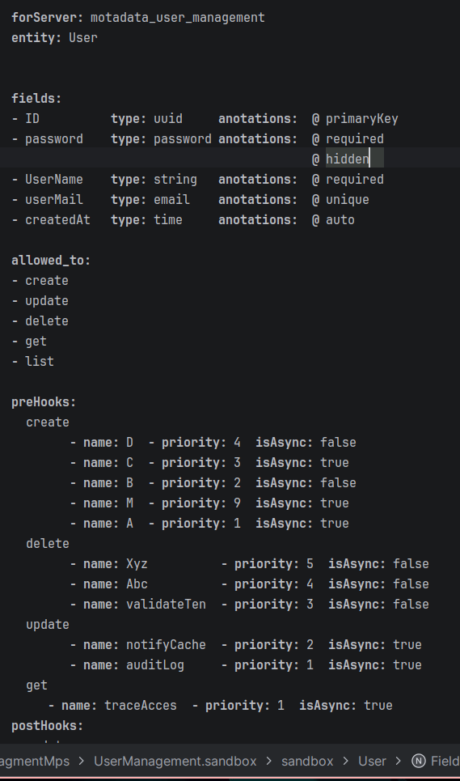

# MotaDSLUM — NATS User Management DSL

> A Domain-Specific Language built with JetBrains MPS that generates production-ready NATS microservices from entity definitions.

**3 entity definitions &rarr; 1,790 lines of Go &rarr; 21 passing e2e tests**

## What This Repository Contains

Complete documentation and artifacts for MotaDSLUM, an internal DSL that generates NATS-based User Management microservice code from high-level entity definitions.

| Section | Description |
|---------|-------------|
| [Documentation](docs/) | Meeting deck, blog post, Feynman technical guide, onboarding guide |
| [Knowledge Graph](knowledge-graph/) | 30 interconnected knowledge nodes across 12 categories |
| [Tutorial Videos](videos/) | 6 screencasts covering MPS project creation through plugin packaging |
| [Scripts](scripts/) | Pipeline tools: sync.sh, merge_hooks.py, parse_textgen.py, demo.sh |
| [Generated Code](generated/) | DSL-generated Go handlers + SQL schema |
| [Docker](docker/) | Dockerfile + docker-compose.yml for NATS + app |
| [Screenshots](screenshots/) | 9 MPS editor views |

## Tutorial Videos

All videos available on **[OneDrive](https://motadataindia-my.sharepoint.com/:f:/g/personal/prem_modha_motadata_com/IgCDB6_PNgfISqqh40kOw1X2ATsXx-tgB0XvUwqvxDMRC5Q?e=4RYzHG)**.

| # | Topic | What you'll learn |
|---|-------|-------------------|
| 1 | Creating a New MPS Project | Setting up the workspace, language module, sandbox |
| 2 | TextGen Template Authoring | Writing code generation templates character by character |
| 3 | Custom Behaviour Methods | Adding computed properties and helper logic to concepts |
| 4 | Packaging as MPS Plugin | Building a distributable .zip plugin |
| 5 | Installing and Using the Plugin | End-user workflow for consuming the DSL |
| 6 | **Bonus: Splitting One File into Many** | Overcoming the 1:1 root-to-file constraint |

## Quick Start

| Goal | Start here |
|------|-----------|
| New to the project | [Onboarding Guide](docs/onboarding-guide.md) |
| Full technical deep-dive | [Feynman Guide](docs/feynman-guide/) |
| Presenting to stakeholders | [Meeting Presentation](docs/meeting-presentation.md) |
| Writing about it externally | [Blog Post](docs/blog-post.md) |
| Understanding a specific topic | [Knowledge Graph](knowledge-graph/) |
| Watching tutorials | [Videos](videos/) &mdash; [OneDrive](https://motadataindia-my.sharepoint.com/:f:/g/personal/prem_modha_motadata_com/IgCDB6_PNgfISqqh40kOw1X2ATsXx-tgB0XvUwqvxDMRC5Q?e=4RYzHG) |

## Architecture

```
MPS DSL Editor                    Generated Output
+-----------------+               +------------------+
| Entity: User    |    sync.sh    | user.go          |
|   fields        | ------------> | roles.go         |
|   hooks         |  merge_hooks  | permissions.go   |
|   operations    |    .py        | userDefinedHooks |
+-----------------+               | main.go          |
| Relation: Roles |               | init.sql         |
+-----------------+               +------------------+
| SqlSchema       |                       |
| Main config     |               docker-compose up
+-----------------+                       |
                                  +------------------+
                                  | NATS Microservice|
                                  | 21 e2e tests     |
                                  +------------------+
```

## MPS Editor

| | |
|---|---|
|  |  |
| User entity: fields, types, annotations | Pre/post hooks with priority and async |
|  |  |
| All 5 root concepts in sandbox | All 19 DSL concepts |

## Building HTML/PDF

```bash
cd build && python3 build.py
# Outputs to dist/html/ and dist/pdf/
```

Requires: `pandoc`, `asciidoctor` (gem), `weasyprint` (uv tool)

## Stats

| Metric | Count |
|--------|-------|
| Knowledge nodes | 30 |
| Graph edges | 92 |
| Categories | 12 |
| Tutorial videos | 6 |
| MPS screenshots | 9 |
| Generated Go lines | 1,790 |
| E2E tests | 21 |
